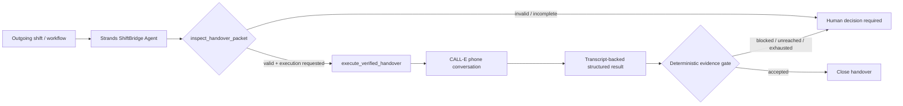

# Agents for Humans — ShiftBridge submission draft

## Track
Professional Agents

## One-line pitch
ShiftBridge is a Strands Agent that prevents unfinished operational work from disappearing at shift change by validating the handover packet, placing a bounded CALL-E phone handover, and surfacing only evidence-backed acceptance or a human escalation.

## Problem
Factories, warehouses, facilities, and field-service teams regularly transfer unresolved work between shifts. Tickets and chat messages prove information was sent, but they do not prove the incoming owner understood the unresolved condition, accepted the next action, or disclosed a blocker before the outgoing shift leaves.

## Solution
ShiftBridge turns the handover into an agentic workflow. A Strands Agent first checks whether the packet contains the minimum facts needed for a safe handover. It refuses to invent missing data. When execution is explicitly requested, it invokes a CALL-E phone tool that asks the incoming owner for a read-back and explicit ownership. Deterministic host-side evidence gates then classify the result as `accepted`, `blocked`, `unreached`, or `needs_supervisor`.

The important design choice is that the agent does **not** make machinery-safety or emergency decisions. It automates continuity work and only surfaces a human when a real decision or unresolved blocker remains.

## Why Strands Agents matters
Strands is the orchestration layer rather than a decorative wrapper. The agent decides which tool is appropriate, validates the handover before side effects, enforces a bounded operating policy through its system prompt, and exposes trace attributes for the workflow. The tools remain independently testable, while the agent provides the natural-language planning loop and human-facing reasoning layer.

## Architecture



## Repository entrypoints
- `strands_agent.py` — Strands Agents implementation.
- `app.py` — CALL-E execution layer plus deterministic evidence gates and idempotency protection.
- `examples/p1_temperature_excursion.json` — ready-to-run manufacturing handover scenario.
- `test_app.py` — host-side workflow tests.

## Demo flow (under 5 minutes)
1. Show the example incident packet and explain the outgoing-shift problem.
2. Run `python strands_agent.py examples/p1_temperature_excursion.json` to show validation without side effects.
3. Explain that invalid or incomplete packets stop before a call.
4. With a supported CALL-E recipient and `CALLE_API_KEY` configured, run the same command with `--execute`.
5. Show the returned structured evidence and the final handover disposition.
6. Close on the principle: the agent stays quiet when transfer is proven, and surfaces a human only when ownership did not actually cross the shift boundary.

## Setup

```bash
python -m venv .venv
source .venv/bin/activate  # Windows: .venv\Scripts\activate
pip install -r requirements.txt

# Configure the model provider supported by Strands Agents.
# For phone execution also set:
export CALLE_API_KEY="..."

python strands_agent.py examples/p1_temperature_excursion.json
python strands_agent.py examples/p1_temperature_excursion.json --execute
```

## Safety and scope
ShiftBridge never invents incident facts or transcript quotes, never authorizes a machine restart, and never decides whether equipment is safe. External phone execution is separated behind an explicit execution request and the existing CALL-E layer uses deterministic idempotency protection to avoid duplicate calls on workflow retries.

## Devpost checklist
- [ ] Join the Agents for Humans hackathon on Devpost.
- [ ] Add an AWS Builder ID to the submission.
- [ ] Record a working demo video of 5 minutes or less.
- [ ] Add the public video URL.
- [ ] Confirm the repository About/license field visibly shows MIT.
- [ ] Submit this repository URL: https://github.com/dlxoghks1993-art/shiftbridge
- [ ] Paste the architecture diagram and submission description.
- [ ] Final submit before Sep 14, 2026 5:00 PM PDT.
